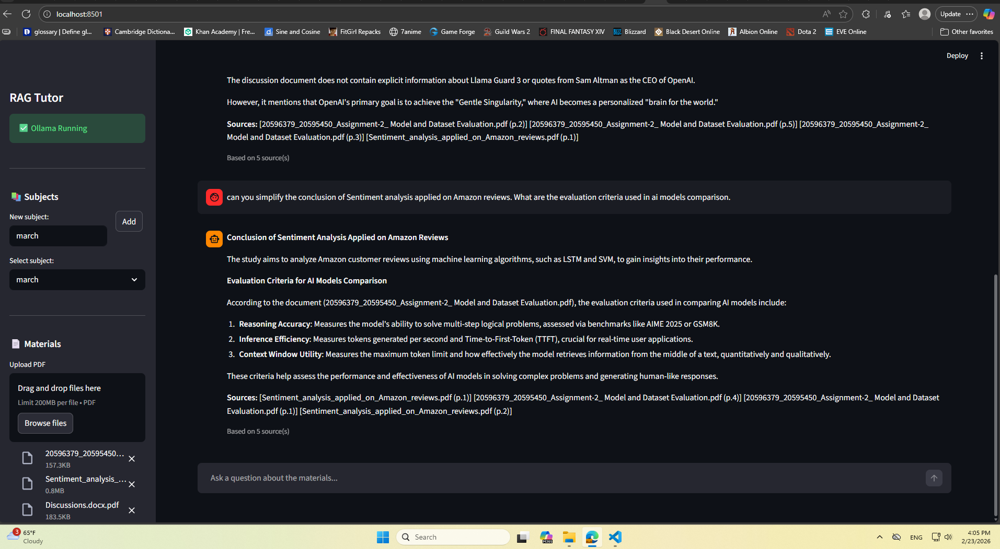
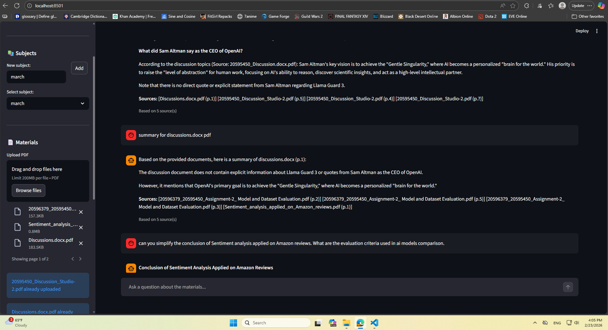

# RUSS: RAG-Based Tutor for Specific Subjects

[](https://github.com/elsayedelmandoh/russ-rag-based-tutor-for-specific-subjects-genai-queens)
[](https://www.linkedin.com/posts/elsayed-elmandoh-b5849a1b8_can-an-air-gapped-ai-tutor-answer-curriculum-activity-7438317665930067968-TdoF?utm_source=share&utm_medium=member_desktop&rcm=ACoAADKeEvQBHt4xOmwiQTXdmYQjiJS81WuE3sc)

<p align="center">
  
  &nbsp; &nbsp;
  
</p>

## Table of Contents
- [Overview](#overview)
- [Quick Start](#quick-start)
- [How to Use](#how-to-use)
- [Architecture](#architecture)
- [Configuration](#configuration)
- [Validation](#validation)
- [Troubleshooting](#troubleshooting)
- [Model Information](#model-information)
- [Performance Benchmarks](#performance-benchmarks)
- [Development](#development)
- [Known Limitations](#known-limitations)
- [Contributing](#contributing)
- [Author](#author)


## Overview

RUSS is a **private, offline Retrieval-Augmented Generation (RAG) system** designed as a "Private NotebookLM" for educational institutions. It ingests PDF course materials into a secure locally-hosted vector store and allows students to ask natural language questions with citation-backed answers.

**Key Features:**
- 📚 Hybrid retrieval (BM25 keyword search + semantic vector search)
- 🔐 Fully offline and air-gapped (no cloud dependencies)
- 📑 Source-backed citations with page numbers
- ⚡ Cross-encoder reranking for accuracy
- 🛡️ Safety guardrails for educational compliance
- 🎯 Subject-based document organization

## Quick Start

### Prerequisites

- **Python 3.9+** (tested on 3.11) - Run setup.bat for windows/ setup.sh for linux
- **Ollama** (for running local LLMs) - [Download](https://ollama.ai)
- **pip** (Python package manager)

### 1. Install Dependencies

```bash
pip install -r requirements.txt
```

### 2. Start Ollama

Open a separate terminal and start the Ollama server:

```bash
ollama serve
```

### 3. Pull Required Models (One-time Setup)

In another terminal, pull the required models:

```bash
ollama pull llama3.2          # Main reasoning engine
ollama pull nomic-embed-text  # Embeddings model
ollama pull llama-guard3:1b   # Safety guardrails
```

**Note:** First download may take 10-30 minutes depending on your internet connection.

### 4. Run the Application

From the project root directory:

```bash
streamlit run app.py
```

The app will open in your browser at `http://localhost:8501`

## How to Use

### Step 1: Create a Subject

1. In the left sidebar, click on the "📚 Subjects" section
2. Type in a subject name (e.g., "Radar Systems", "Signal Processing")
3. Click "Add"

### Step 2: Upload Materials

1. Select your created subject
2. Use the "📄 Materials" uploader to upload PDF files
3. Wait for processing (status shows ⏳ → 🔄 → ✅ or ❌)

### Step 3: Ask Questions

1. Once documents show ✅ (READY status), type your question in the chat box
2. The system will:
   - Search documents using hybrid retrieval
   - Rerank results for relevance
   - Generate a grounded answer
   - Show sources with page numbers

## Architecture

### The RAG Pipeline

```
1. INGESTION (Document Upload)
   PDF → Parse → Chunk → Embed → Store

2. RETRIEVAL (User Question)
   Query → Hybrid Search → Rerank → Extract Context

3. GENERATION (Response)
   Context + Query → LLM → Answer + Citations
```

### Key Components

| Module | Purpose |
|--------|---------|
| **config/** | Settings and prompts configuration |
| **models/** | Pydantic schemas for type safety |
| **ingestion/** | PDF parsing, chunking, embedding |
| **retrieval/** | Vector store, BM25, hybrid search, reranking |
| **generation/** | LLM integration, RAG orchestration, citations |
| **safety/** | Content safety filtering |
| **utils/** | Helper functions |

## Configuration

### Environment Variables (.env)

```env
# Ollama Server
RUSS_OLLAMA_BASE_URL=http://localhost:11434
RUSS_LLM_MODEL=llama3.2
RUSS_EMBEDDING_MODEL=nomic-embed-text
RUSS_GUARD_MODEL=llama-guard3:1b

# Chunking Strategy
RUSS_CHUNK_SIZE=1000           # Characters per chunk
RUSS_CHUNK_OVERLAP=100         # Overlap between chunks

# Retrieval
RUSS_SEMANTIC_WEIGHT=0.7       # Weight for vector similarity
RUSS_BM25_WEIGHT=0.3           # Weight for keyword matching
RUSS_RETRIEVAL_K=20            # Number of candidates to retrieve
RUSS_RERANK_TOP_N=5            # Top results after reranking

# Storage & Parsing
RUSS_CHROMADB_PATH=./data/chromadb
RUSS_UPLOADS_PATH=./data/uploads
RUSS_PDF_PARSER=pymupdf        # Can also be: marker
RUSS_MAX_FILE_SIZE_MB=100      # Max upload size
```

## Validation

Check that everything is set up correctly:

```bash
python validate.py
```

Expected output:
```
[1/6] Importing schemas... ✓
[2/6] Importing settings... ✓
[3/6] Importing config prompts... ✓
[4/6] Importing core modules... ✓
[5/6] Importing utilities... ✓
[6/6] Checking Ollama health... ✓
```

## Troubleshooting

### ❌ "Ollama Not Running"
```bash
# In a separate terminal:
ollama serve
```

### ❌ "Model Not Found"
```bash
# Pull the missing models:
ollama pull llama3.2 nomic-embed-text llama-guard3:1b
```

### ❌ Slow Performance
- Reduce `RUSS_RETRIEVAL_K` (from 20 to 10)
- Reduce `RUSS_CHUNK_SIZE` to get fewer, smaller chunks
- Increase `RUSS_BM25_WEIGHT` if documents have specific terminology

### ❌ Out of Memory
- Reduce chunk size in `.env`
- Use a smaller embedding model
- Reduce number of results in `RUSS_RETRIEVAL_K`

## Model Information

- **llama3.2**: 14B parameter reasoning model (4.2GB)
- **nomic-embed-text**: 137M embedding model (274MB)
- **llama-guard3:1b**: Safety classifier (1.2GB)

**Total disk space needed:** ~6GB

**Recommended RAM:** 12GB+ for optimal performance

## Performance Benchmarks

- **Document Ingestion**: 1-2 min per 100-page PDF
- **Query Processing**: 3-8 seconds total
  - Retrieval: 50-100ms
  - Reranking: 100-500ms
  - Generation: 2-5 seconds

## Development

### Running Tests

```bash
pytest tests/unit -v
pytest tests/integration -v
```

### Extending the System

1. **Add a new retriever:** Create class in `src/retrieval/`
2. **Customize prompts:** Edit `src/config/prompts.py`
3. **Add safety categories:** Modify `src/safety/guardrail.py`

## Known Limitations

- ❌ No image/diagram analysis (text only)
- ❌ No model fine-tuning
- ❌ No chat history persistence across sessions
- ❌ No user authentication

## License & Attribution

This project is part of the Air Defense College curriculum initiative.

## Contributing
1. Fork the repository.
2. Create a branch for your change.
3. Make changes, commit with clear messages.
4. Push to your fork and open a pull request.

## Author
Developed by Mohamed Kamal - AI Engineer.   
LinkedIn: https://www.linkedin.com/in/mohamed-kamal-has/?utm_source=share_via&utm_content=profile&utm_medium=member_android

Developed by Elsayed Elmandoh — NLP Engineer.  
LinkedIn: https://linkedin.com/in/elsayed-elmandoh-b5849a1b8/  
X/Twitter: https://x.com/aangpy

---

**For detailed architecture docs, see:** [docs/01_project_definition/](docs/01_project_definition/)

**Questions?** Check the docs or review `validate.py` for system health checks.

**Happy Learning! 📚✨**
