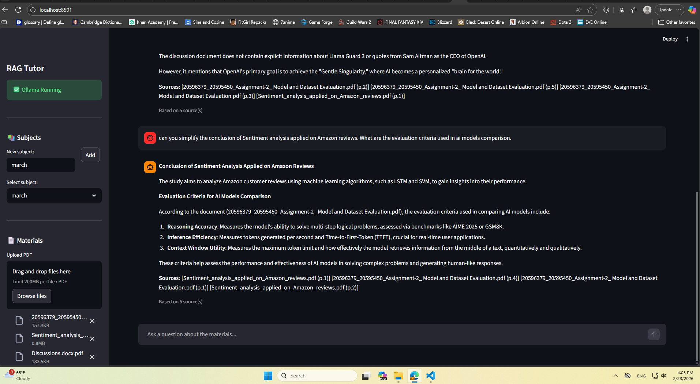
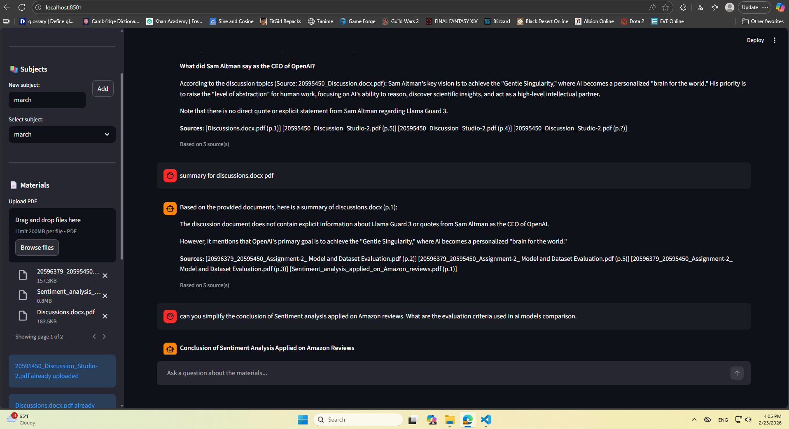

# Beauty E-Commerce RAG Chatbot 🛍️

  
  &nbsp; &nbsp;
  

A production-ready RAG chatbot for beauty e-commerce websites.
Answers customer questions about products, orders, and shipping
in both Arabic and English.

## 📋 Project Overview
Built for a beauty products e-commerce client.
Connects to product catalog (Excel) via RAG pipeline
to provide accurate, real-time answers.

## ✨ Features
- RAG pipeline connected to 100+ product catalog
- Bilingual support (Arabic + English)
- Product info, pricing, orders & shipping answers
- Clean embeddable UI (one line of code to add to website)
- Real-time accurate responses from product data

## 🛠️ Tech Stack
- Python + Streamlit
- LangChain (RAG pipeline)
- Google Gemini API
- FAISS (vector database)
- Pandas (Excel processing)
- OpenAI Embeddings

## 📦 Installation
pip install -r requirements.txt

## ⚙️ Setup
1. Add your API key to .env:
   GOOGLE_API_KEY=your_key_here
2. Place your Excel file in /data folder
3. Run: streamlit run app.py

## 📁 Project Structure
├── app.py              # Main Streamlit app
├── rag_pipeline.py     # RAG logic
├── data_loader.py      # Excel processing
├── requirements.txt
└── README.md

## 💬 Usage
1. Upload your product Excel file
2. Ask questions in Arabic or English
3. Get instant accurate answers

## 📊 Results
- 100+ products indexed
- Bilingual (AR/EN) support
- Deployed on client website ✅

## 👤 Author
Elsayed Elmandoh
NLP Engineer | MSc AI @ Queen's University
github.com/elsayedelmandoh
